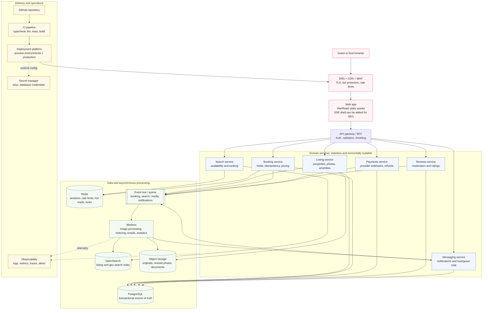

# Vacation-rental marketplace architecture

This diagram describes a production-scale target architecture for the vacation-rental marketplace represented by this clone. The current Vite app is the web presentation layer; the services and platform components below are the scale-out path for a real marketplace.

## Scaling strategy

- **Frontend:** immutable hashed assets are served from the CDN. The app is stateless, so traffic scales at the edge without adding web-server coordination.
- **Backend:** the API gateway routes to independently scalable stateless domain services. Idempotency keys protect booking and payment retries.
- **Storage:** PostgreSQL owns transactional data such as reservations and payments. Redis handles short-lived coordination and hot reads. Object storage keeps media outside the database.
- **Search:** listing and geo-search reads use OpenSearch, updated asynchronously from domain events. PostgreSQL remains authoritative for availability and booking confirmation.
- **Async work:** an event bus isolates image resizing, indexing, email, notifications, and analytics from user-facing request latency.
- **Deployment:** GitHub changes run through typecheck, lint, tests, and build. Every change can get a preview deployment; production is promoted from a successful build with managed secrets and observability attached.
- **Reliability:** services can scale independently, queues provide back-pressure, Redis locks reduce double-booking races, and database backups plus multi-zone deployment protect the source of truth.

## Current clone boundary

The submitted clone intentionally keeps the listing page static and local: listing content is in `src/data/listing.ts`, images are in `public/images`, and Vite serves the React UI. The production components in the diagram are the integration boundary for turning those local reads into a real marketplace without changing the visual contract of the page.
